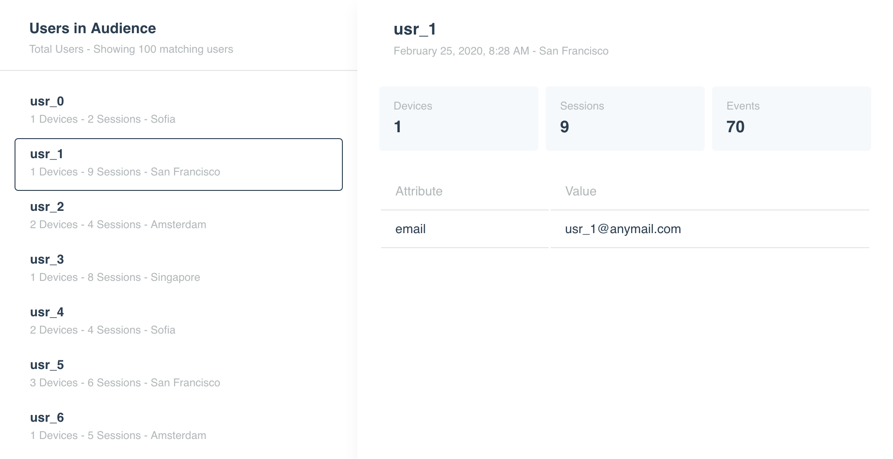

# Leanplum Frontend Project

Thank you for your interest in joining Leanplum!

During your interview, you'll build a modern web application with Vue, React, or Angular (your choice). If you would like to experience what our daily work feels like, we're providing this sample project that uses our development stack and configuration. Note that using this application is **not required** for the interview &mdash; use whatever stack you are most comfortable with.

# Project setup

If you decide to use this sample project, here are a few tips:

- To set up the project dependencies, run `yarn install`.

- To run a development server that compiles and hot-reloads, use `yarn serve`.

- To run the unit tests, use `yarn test:unit`.

- To lint and fix style issues, use `yarn lint`.

# Project specification

Create a page that looks like the image below.

### Requirements

- Focus on what's most important; we don't require the page to be pixel-perfect match of the picture.

- Split your code in at least 3 components, but don't overdo it.

- Bind the list to the sample data provided in `src/models/UsersEntity.ts`.

- Selecting an item from the list should display its details in the details view.

### Styling

At Leanplum, designers work with [Abstract](https://www.abstract.com/home) that provides a style inspector to quickly find the colors and sizes used in a design. For the sake of the interview, we've extracted the required colors and styles in the below list.

#### Fonts

- Title: `16px`
- Subtitle: `12px`
- User ID (in list): `14px` bold
- User ID (in details): `18px` bold
- Tile title: `12px`
- Tile value: `18px` bold

#### Colors

- Subtitle color: `#b2b7b9`
- Tile background: `#f6f9fb`
- Tile title color: `#b2b7b9`
- Table border color: `#e1e4e5`
- Table header color: `#b2b7b9`

### Spacing

Our design system uses `4px`, `8px`, `16px`, or `24px`.

### Other

Border radius is `4px`.

Box shadow: `0 8px 20px 0 rgba(0,0,0,0.05)`
